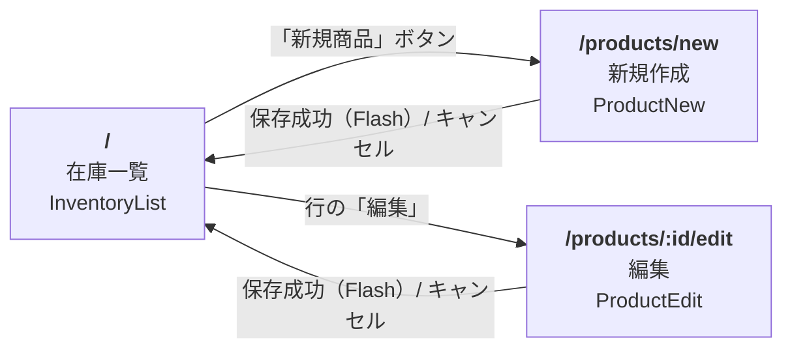
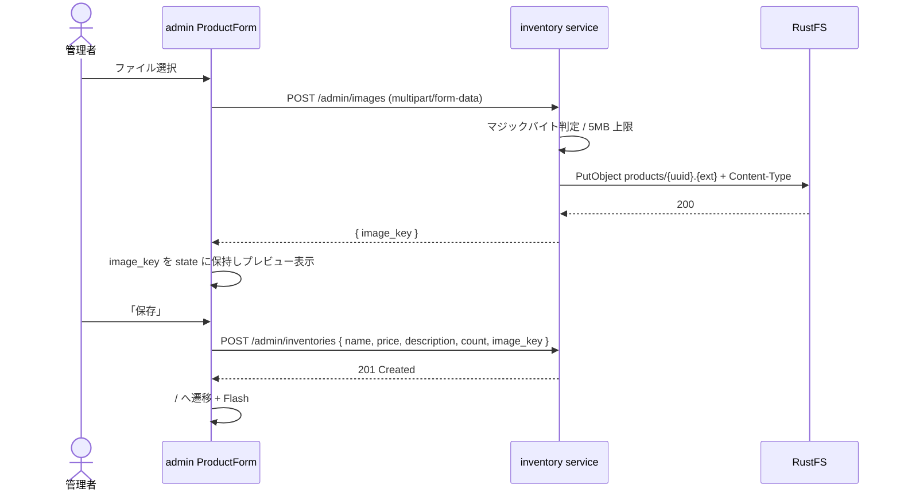
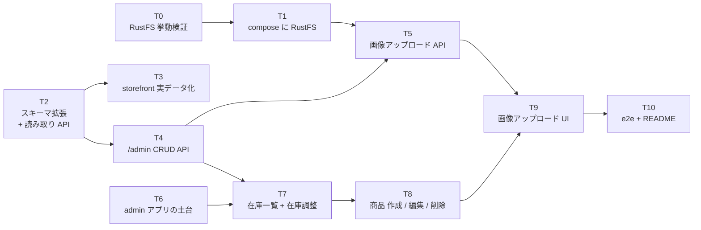
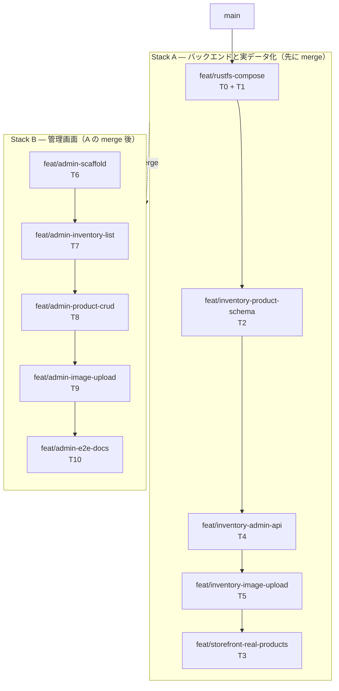

# 管理者向けサイト（在庫管理）設計

商品の CRUD と画像アップロードを行う管理者向けフロントエンドを新設し、画像置き場に RustFS を使う。
storefront からも RustFS の画像を参照させる。認証は今回入れない（後付け前提の構造だけ用意する）。

この文書は実装前の設計合意を記録したもの。まだ実装していない。

---

## 1. 現状（着手前）

| 事実 | 位置 |
|---|---|
| `inventories` は `id INTEGER PRIMARY KEY` / `name TEXT` / `count INTEGER` のみ。price も image も description もない | `services/inventory/db/migrations/001_create_inventories.sql` |
| `id` は `SERIAL` / `IDENTITY` ではなく素の `INTEGER`。seed が id を直指定しており、採番の仕組みがない | 同上、`002_seed_inventories.sql` |
| storefront が `price: 0` と `https://placehold.co/400x300` を捏造している | `frontends/storefront/src/features/product/api.ts:20-25` |
| その `imageUrl` は実際には使われず、SVG プレースホルダを描画している | `frontends/storefront/src/features/product/components/ProductList.tsx:7-16` |
| `order_items.inventory_id` は **FK ではない**（別サービス別 DB なので当然）。DB レベルの参照整合性がない | `services/order/db/migrations/` |
| k6 が `INVENTORY_IDS = [1,2,3,4,5]` をハードコードしている | `k6/ec-traffic.js:36` |
| inventory のテストは stub ベースの domain / usecase unit test のみ。handler と repository は未テスト | `services/inventory/internal/{domain,usecase}/*_test.go` |
| storefront の e2e は `page.route` でネットワークをモックする方式（実サービス不要） | `frontends/storefront/e2e/` |
| CI は「1アプリ = 1ワークフロー + `paths-filter` + `working-directory` 固定」 | `.github/workflows/` |
| compose には `kafka-init` という one-shot init コンテナのパターンが既にある | `compose.yaml` |

## 2. RustFS について確認した事実

- image `rustfs/rustfs:latest`（`1.0.0-rc.4` などピン留め可）
- **9000 = S3 API / 9001 = コンソール**、既定資格情報 `rustfsadmin` / `rustfsadmin`
- ボリュームは `/data` と `/logs`
- コンテナは **UID/GID 10001 の非 root** で動く。bind mount だと権限で落ちるので **named volume を使う**（このリポは既に named volume 主義なので整合する）
- **presigned GET / PUT は Supported**
- **bucket policy の put / get / delete も Supported**
- **CORS は「選択されたケースのみ」の部分対応**
- **ACL は「意図的に非サポート」**
- 匿名 public read はドキュメント上明言なし → 検証項目（§6）

## 3. 決定事項

| # | 論点 | 決定 | 理由 |
|---|---|---|---|
| 1 | 商品ドメインの所有者 | **inventory service を拡張**（新サービスは作らない） | スコープ最短。既存の捏造データをすぐ実データに置換できる。新サービスは DB / Kafka / OTel / compose / CORS の配線が丸ごと増える。後で catalog service に切り出す道は残る |
| 2 | テーブル設計 | **`inventories` 1テーブルを拡張**（1行 = 1商品 = 1在庫） | seed が既に「Tシャツ（M）」「（L）」を別行にしており実質 SKU 粒度。order / storefront / k6 が全部 `inventory_id` 前提なので破壊的変更がゼロ |
| 3 | API 境界 | 読みは `GET /inventories` を公開のまま、書きは **`/admin/*`** に集約 | gin の route group はパス単位。後で `adminGroup.Use(authMiddleware)` の1行で全書き込みを守れる。メソッド単位で守るより漏れない |
| 4 | アップロード経路 | **`POST /admin/images` でサービス経由プロキシ**（multipart/form-data → AWS SDK for Go v2 で PutObject） | RustFS の CORS が部分対応なのでブラウザから直叩きしない。資格情報がサーバ内に閉じる。検証をサーバ側で強制できる。S3 呼び出しが OTel span に乗る |
| 5 | 画像の参照 | **バケットを public read にして直参照**。DB には object key のみ保存 | `` の単純 GET に CORS プリフライトは不要なので RustFS の弱点を踏まない。EC の商品画像は本質的に公開コンテンツ。storefront と admin が同じ URL を使える |
| 6 | 管理画面の構成 | **`frontends/admin/` に独立アプリ**（storefront と同スタック） | 既存 CI が「1アプリ = 1ワークフロー」なのでワークフロー1本追加で済む。購入者向けと管理画面のデザイン言語を混ぜない。認証を admin だけに入れられる |
| 7 | 削除 | **物理削除** | サンプルサイトなのでデータ消失が問題にならない。論理削除のコスト（全クエリの `WHERE`、既存 repository とテストの意味変更、削除済み表示の UI 分岐）に見返りがない |
| 8 | 画像の寿命 | **immutable、孤児は放置**（key は UUID、上書きしない） | ローカルのサンプルでストレージコストが問題にならない。DB と S3 の 2フェーズコミット問題を回避できる |
| 9 | 在庫数の変更 | `PUT` は属性のみ。在庫は **`POST /admin/inventories/:id/adjust`（delta、負も許可）** | 既存 domain は `Reserve` / `Restock` という差分メソッドしか持たず `RunInTx` + `SELECT FOR UPDATE` で守る設計。差分ならその構造に乗る。絶対値 set は Saga の reserve と lost update を起こす。新規作成（POST）だけは競合がないので count を絶対値で受ける |
| 10 | バケット初期化 | **`rustfs-init` ワンショットコンテナ**（`create-bucket` + `put-bucket-policy`） | `kafka-init` が同型のパターンを確立済み。`docker compose up -d` だけで完結する現在の UX を保てる。サービスに bucket 作成権限を持ち込まない |
| 11 | 画像枚数 | **1枚 / `image_key TEXT NULL`**。未設定なら既存 SVG プレースホルダにフォールバック | 決定2（1テーブル）と整合。storefront のカードは1枚しか使わない。NULL 許容なら「画像なしで作ってあとで付ける」が自然に動く |
| 12 | アップロード処理 | **検証のみ**。jpeg / png / webp をマジックバイトで判定（拡張子と Content-Type は信用しない）、5MB 上限、key は `products/<uuid>.<ext>`、Content-Type 付きで保存 | スコープ内に収まる。マジックバイト検証とサイズ上限は §5 のリスクへの最低限の緩和。リサイズは後から足せる |
| 13 | storefront | 一覧カードに**実画像・実 price・description**（2行クランプ）。商品詳細ページは作らない | 管理画面で入力した description が storefront のどこにも出ないとカラムの価値が半分死ぬ。2行クランプなら追加コストがほぼゼロ |
| 14 | 管理画面の画面 | **一覧 + `/products/new` + `/products/:id/edit`** の3ページ。在庫調整は一覧の行内（− / 数量 / ＋） | 画像アップロード＋プレビュー＋複数フィールドはモーダルに手狭。URL で編集対象が表現されリロードと戻るが自然に動く。在庫調整を一覧行内に置くのは「一覧を見ながら調整する」実務に合う |
| 15 | テスト | **既存水準に揃える**（§4 に内訳） | リポの実際のテスト水準に合わせるのが一貫している。水準を上げるなら別 PR |
| 16 | デザイン | **業務ツールとして別デザイン**。ライトテーマ・システムフォント・等幅数字・高密度テーブル。アクセント色に storefront の sage を借りる | 管理画面は長時間数値を読む道具で要求が storefront と正反対。Cormorant Garamond のような display serif は数値テーブルに向かない |

### スコープ外（合意済み）

認証・認可 / 管理画面からの注文管理 / 検索・ソート・ページネーション / 商品バリアント / 複数画像 /
storefront の商品詳細ページ / 監査ログ・変更履歴 / 画像リサイズ・CDN / 下書き・公開状態。

## 4. 変更範囲

### `services/inventory/`

- migration 003: `price` / `description` / `image_key` / `created_at` / `updated_at` を追加、`id` を `GENERATED BY DEFAULT AS IDENTITY` 化（seed の直指定 id と共存できる形）、seed 5件に妥当な価格を投入
- `internal/domain/`: `Inventory` に新フィールド、`ImageStorage` interface を追加（既存 `InventoryRepository` と同じ設計思想）
- `internal/usecase/`: Create / Update / Delete / Adjust / UploadImage
- `internal/repository/postgres/`: 新カラム対応、Insert / Update / Delete
- `internal/adapter/storage/`: AWS SDK for Go v2 による `ImageStorage` 実装
- `internal/adapter/http/`: `/admin` route group、`POST /admin/images`
- `config/config.go`: **`CORS_ORIGIN`（単数）を複数対応に変更**（§7）、RustFS 接続設定を追加

price は日本円なので `INTEGER`（最小単位）で持つ。

### `compose.yaml`

- `rustfs`（9000 / 9001、named volume、healthcheck）
- `rustfs-init`（`amazon/aws-cli` で `create-bucket` + `put-bucket-policy`、`inventory` は `service_completed_successfully` で待つ）
- `admin`（3002）
- inventory に RustFS 環境変数、CORS に admin origin を追加

ポート衝突なし: 3000 Grafana / 3001 storefront / **3002 admin** / 8081 order / **9000-9001 RustFS** / 18081 inventory / 19092 Kafka。

### `frontends/admin/`（新規一式）

React 19 + TypeScript + Vite + TailwindCSS v4 + React Router v7 + TanStack Query + msw + vitest + Playwright。
Dockerfile と nginx.conf は storefront と同型（SPA フォールバック）。

環境変数: `VITE_INVENTORY_API_BASE_URL`、`VITE_IMAGE_BASE_URL`。

### `frontends/storefront/`

- `features/product/api.ts`: `toProduct` の捏造を削除し `/inventories` のレスポンスをそのまま使う
- `features/product/components/ProductList.tsx`: `image_key` があれば ``、なければ既存 SVG にフォールバック。description を2行クランプ
- `src/mocks/handlers.ts` / `api.test.ts` / `ProductList.test.tsx` / `e2e/product.spec.ts`: フィクスチャ更新
- 画像表示とフォールバックのテストを追加

`VITE_IMAGE_BASE_URL` は `VITE_INVENTORY_API_BASE_URL` と同じ形で渡す。compose 内は `rustfs:9000` だが**ブラウザで動く JS なので `http://localhost:9000/<bucket>` を渡す**。

### `.github/workflows/ci-admin.yaml`

`ci-storefront.yaml` と同型（`paths-filter` + `working-directory: frontends/admin`）を1本追加。

### テストの内訳（決定15）

| 対象 | 書くもの | 書かないもの |
|---|---|---|
| inventory | `ImageStorage` を stub にした domain / usecase の unit test | handler と repository（既存も未テスト） |
| admin | vitest + msw で api / hooks / components、Playwright e2e 1本（商品作成 → 一覧に出る） | — |
| storefront | 既存テストのフィクスチャ更新 + 画像表示 / フォールバック | — |

## 5. `frontends/admin/` のディレクトリ構成

storefront の `CLAUDE.md` が定めた方針をそのまま踏襲する
（`pages/` = ルート単位、`features/<domain>/` = 機能ドメイン単位、`shared/` = 複数ページで使う共通物）。

```
frontends/admin/
├── e2e/
│   └── product.spec.ts                    # 商品作成 → 一覧に出る（page.route でモック）
├── public/
├── src/
│   ├── features/
│   │   ├── inventory/                     # 在庫（= 商品）ドメイン
│   │   │   ├── api.ts                     # GET /inventories, POST/PUT/DELETE /admin/inventories, POST /admin/inventories/:id/adjust
│   │   │   ├── api.test.ts
│   │   │   ├── components/
│   │   │   │   ├── InventoryTable.tsx     # 一覧テーブル（等幅数字・高密度）
│   │   │   │   ├── InventoryTable.test.tsx
│   │   │   │   ├── StockAdjuster.tsx      # 行内の − / 数量 / ＋
│   │   │   │   ├── StockAdjuster.test.tsx
│   │   │   │   ├── ProductForm.tsx        # new と edit で共用
│   │   │   │   └── ProductForm.test.tsx
│   │   │   └── hooks/
│   │   │       ├── useInventories.ts      # 一覧
│   │   │       ├── useInventory.ts        # 単体（編集ページの初期値）
│   │   │       ├── useCreateProduct.ts
│   │   │       ├── useUpdateProduct.ts
│   │   │       ├── useDeleteProduct.ts
│   │   │       └── useAdjustStock.ts      # delta を送る
│   │   └── image/
│   │       ├── api.ts                     # POST /admin/images
│   │       ├── api.test.ts
│   │       ├── components/
│   │       │   └── ImageUploader.tsx      # ファイル選択 + プレビュー + アップロード中表示
│   │       └── hooks/
│   │           └── useUploadImage.ts
│   ├── pages/
│   │   ├── InventoryList/index.tsx        # /
│   │   ├── ProductNew/index.tsx           # /products/new
│   │   └── ProductEdit/index.tsx          # /products/:id/edit
│   ├── shared/
│   │   ├── Layout/index.tsx               # ヘッダ + <Outlet />
│   │   ├── Flash/                         # storefront と同型のトースト（context.tsx / index.tsx）
│   │   ├── imageUrl.ts                    # image_key → VITE_IMAGE_BASE_URL + key
│   │   └── ui/
│   │       ├── Button.tsx
│   │       ├── Input.tsx
│   │       ├── Table.tsx
│   │       └── ConfirmDialog.tsx           # 削除確認
│   ├── mocks/
│   │   ├── browser.ts
│   │   ├── handlers.ts
│   │   └── server.ts
│   ├── index.css                          # @theme で管理画面用トークン（ライト・システムフォント・等幅数字）
│   ├── main.tsx                            # BrowserRouter + Routes
│   ├── test-setup.ts
│   └── test-utils.tsx
├── .dockerignore
├── .env.local                             # VITE_INVENTORY_API_BASE_URL / VITE_IMAGE_BASE_URL
├── Dockerfile                             # storefront と同型（builder → nginx）
├── eslint.config.js
├── index.html
├── nginx.conf                             # SPA フォールバック
├── package.json
├── playwright.config.ts
├── pnpm-workspace.yaml                    # onlyBuiltDependencies: [msw]（pnpm 10 が要求。storefront と同様）
├── tsconfig.json / tsconfig.app.json / tsconfig.node.json
└── vite.config.ts                         # @ → ./src エイリアス、vitest 設定
```

`shared/imageUrl.ts` は storefront 側にも同等のものが必要になる。決定6（独立アプリ）を選んだので
共有パッケージは作らず、両方に置く。実体は数行なので重複コストは低い。

## 6. 画面遷移

ルートは3つ。在庫調整と削除は**遷移を伴わない**（一覧に留まったまま完結する）。



### 一覧内で完結する操作（遷移なし）

| 操作 | UI | 呼ぶ API | 完了後 |
|---|---|---|---|
| 在庫調整 | 行内の − / 数量 / ＋ | `POST /admin/inventories/:id/adjust`（delta） | 一覧を invalidate して再取得 |
| 削除 | 行の「削除」→ 確認ダイアログ | `DELETE /admin/inventories/:id` | 一覧を invalidate、Flash で通知 |

削除は物理削除（決定7）で取り消せないため、確認ダイアログを必須にする。

### 画像アップロードと保存の順序

画像は**商品の保存より先**に単独でアップロードし、返ってきた `image_key` をフォームの state に保持する。



この順序の帰結として、**画像だけ上げて保存をキャンセルすると `image_key` が孤児になる**。
決定8（画像は immutable、孤児は放置）で既に許容済みなので、追加の後始末はしない。

編集時に画像を差し替えた場合も同様に、旧 `image_key` は RustFS に残る。

## 7. 明示するリスク

**認証がない状態で public read バケットに書ける** ということは、`POST /admin/images` が「誰でも任意ファイルを公開ホスティングできる口」になる。ローカル compose 限定なら実害はないが、

- README に**ローカル専用・外部公開するな**と明記する
- マジックバイト検証とサイズ上限（決定12）を最低限の緩和として入れる

## 8. 実装前に潰す検証項目（T0で検証済み）

1. **RustFS で bucket policy による匿名 GET が実際に効くか。** → **効く。決定5を維持（フォールバック不要）**。
   `rustfs/rustfs:latest` を単体起動し、`amazon/aws-cli` で `s3 mb` → `s3api put-bucket-policy`（`Principal: "*"`, `Action: s3:GetObject`, `Resource: arn:aws:s3:::<bucket>/*`）→ `s3 cp` でオブジェクト配置の後、
   資格情報なしの `curl` で `GET /<bucket>/<key>` が **200** で本文をそのまま返すことを確認した。
   併せて匿名 `PUT` は **403**、存在しないキーへの匿名 `GET` は **404** で、期待どおりの挙動だった。
   よって `` の単純 GET は RustFS へ直参照でよく、inventory service 経由のプロキシ配信は不要。
2. **RustFS の healthcheck の書き方。** → **`GET /minio/health/live` が MinIO互換で使える**。
   資格情報なしで `200 {"status":"ok","ready":true,...}` を返すことを確認した。
   `rustfs-init` は `inventory-postgres` の healthcheck と同様に `curl -sf` で待てる。

## 9. 途中で見つけた既存の不整合（本件とは別に直す価値あり）

- `frontends/storefront/e2e/product.spec.ts:3` が `http://localhost:18080` を指しており、README も 18080 と記載。
  実際の `compose.yaml` と `.env.local` は **18081**。この `page.route` は現在マッチしていないはず
- inventory の `config/config.go:19` は `CORS_ORIGIN`（単数）、order は `CORS_ORIGINS`（複数）で不揃い。
  本件で admin origin を足すため複数対応にする（§4 に含む）
- `k6/ec-traffic.js:36` と e2e が id 1〜5 を前提にしている。
  物理削除（決定7）なので、**管理画面から手で seed 商品を消したときだけ**これらが壊れる。デモを回すときは消さない運用で足りる

## 10. 実装タスク

各タスクは 1 PR 相当。**T0 を最初に済ませる**（結果によって決定5が変わり、T5 と T9 の内容が入れ替わる）。



`T0` / `T2` / `T6` は依存がないので並行して着手できる。
**`T7` 完了時点が最初のマイルストーン**（「在庫の管理ができる」状態。画像はまだ）。

| # | タスク | 依存 | 対象 |
|---|---|---|---|
| T0 | RustFS の挙動検証 | — | 検証のみ（コミットは §8 の結論を本ドキュメントに反映） |
| T1 | compose に RustFS を追加 | T0 | `compose.yaml` |
| T2 | スキーマ拡張と読み取り API | — | `services/inventory/`（migration / domain / repository） |
| T3 | storefront を実データに切り替え | T2 | `frontends/storefront/` |
| T4 | `/admin` CRUD API | T2 | `services/inventory/`（usecase / handler / config） |
| T5 | 画像アップロード API | T1, T4 | `services/inventory/`（`ImageStorage` + S3 adapter） |
| T6 | admin アプリの土台 | — | `frontends/admin/`, `compose.yaml`, CI |
| T7 | 在庫一覧と在庫調整 | T4, T6 | `frontends/admin/features/inventory/` |
| T8 | 商品の作成 / 編集 / 削除 | T7 | `frontends/admin/`（フォーム3ページ） |
| T9 | 画像アップロード UI | T5, T8 | `frontends/admin/features/image/` |
| T10 | e2e と README | T9 | `frontends/admin/e2e/`, README 群 |

---

### T0 — RustFS の挙動検証

§8 の2項目を潰す。コード実装ではなく調査タスク。

- `rustfs/rustfs` を単体で起動し、`aws-cli` でバケット作成 → `put-bucket-policy` で匿名 GET を許可 → **資格情報なしの `curl` でオブジェクトが取れるか**を確認
- healthcheck に使えるエンドポイントを特定する（`/minio/health/live` 互換か、ListBuckets か TCP か）

**完了条件**: §8 の2項目に結論が書かれ、決定5が確定（維持 or プロキシ配信へのフォールバック）していること。
フォールバックした場合は §4 / §5 / §6 の該当箇所も更新する。

### T1 — compose に RustFS を追加

- `rustfs`（9000 / 9001、named volume、T0 で決めた healthcheck）
- `rustfs-init`（`amazon/aws-cli` で `create-bucket` + `put-bucket-policy`）
- アプリコードは触らない

**完了条件**: `docker compose up -d` だけでバケットが作られ、手で put したオブジェクトがブラウザから見える。

### T2 — スキーマ拡張と読み取り API

- migration `003`: `price INTEGER` / `description TEXT` / `image_key TEXT NULL` / `created_at` / `updated_at` を追加、`id` を `GENERATED BY DEFAULT AS IDENTITY` 化、seed 5件に価格を投入
- `domain.Inventory` に新フィールド、`repository/postgres` を新カラム対応
- `GET /inventories` と `GET /inventories/:id` が新フィールドを返す
- 既存の `Reserve` / `Restock` は無変更

**注意**: compose は migrations を `/docker-entrypoint-initdb.d` にマウントしているだけで、
**これはデータディレクトリが空のときしか実行されない**。既存ボリュームには `003` が当たらないので、
`docker compose down -v` でのボリューム再作成が必要。README に明記する。

**完了条件**: `curl localhost:18081/inventories` が price と description を返す。domain の unit test が通る。
追加フィールドなので storefront は無変更で動き続ける（この時点では新フィールドを無視する）。

### T3 — storefront を実データに切り替え

- `features/product/api.ts` の `toProduct`（`price: 0` と `placehold.co`）を削除
- `ProductList.tsx`: `image_key` があれば ``、なければ既存 SVG にフォールバック。description を2行クランプ
- `shared/imageUrl.ts` を追加、`.env.local` と Dockerfile に `VITE_IMAGE_BASE_URL`
- `mocks/handlers.ts` / `api.test.ts` / `ProductList.test.tsx` / `e2e/product.spec.ts` のフィクスチャ更新
- 画像表示とフォールバックのテストを追加

この時点では `image_key` が常に NULL なのでフォールバック経路しか動かないが、price と description は実データになる。

**完了条件**: storefront に実価格と説明が出る。テストが通る。

### T4 — `/admin` CRUD API

- `/admin` route group を新設
- `POST /admin/inventories`（count は絶対値）/ `PUT /admin/inventories/:id`（属性のみ）/ `DELETE /admin/inventories/:id` / `POST /admin/inventories/:id/adjust`（delta、負も許可、結果が負になる場合は 422）
- `config.go` の `CORS_ORIGIN`（単数）を複数対応に変更し、admin origin を追加
- usecase の unit test（stub repository）

`adjust` は既存の `RunInTx` + `SELECT FOR UPDATE` に乗せる。`image_key` は受け取るだけ（アップロード口は T5）。

**完了条件**: curl で CRUD 一巡できる。`adjust` を k6 と同時に走らせても在庫が壊れない。

### T5 — 画像アップロード API

- `domain` に `ImageStorage` interface
- `internal/adapter/storage/`: AWS SDK for Go v2 による実装（`PutObject` + Content-Type）
- `POST /admin/images`: マジックバイトで jpeg / png / webp を判定、5MB 上限、key は `products/{uuid}.{ext}`、`{ image_key }` を返す
- stub を使った usecase の unit test

**完了条件**: curl でアップロードした画像がブラウザから直接見える。T3 が済んでいれば storefront に実画像が出る。

### T6 — admin アプリの土台

- `frontends/admin/` に §5 の設定ファイル一式（`pnpm-workspace.yaml` の `onlyBuiltDependencies: [msw]` を忘れない）
- `index.css` に管理画面用の `@theme` トークン（ライト・システムフォント・等幅数字・アクセントに sage）
- `shared/Layout` / `shared/Flash` / `shared/ui` / `shared/imageUrl.ts`
- `main.tsx` にルーティング3本（ページの中身は空のまま）
- `compose.yaml` に `admin`（3002）、`.github/workflows/ci-admin.yaml`

**完了条件**: `docker compose up -d` で 3002 が開き、3ルートを行き来できる。CI が緑。

### T7 — 在庫一覧と在庫調整

- `features/inventory/api.ts`、`useInventories`、`useAdjustStock`
- `InventoryTable`（サムネイル / 商品名 / 価格 / 在庫数 / 操作）、`StockAdjuster`（行内の − / 数量 / ＋）
- 調整後は一覧を invalidate
- vitest + msw のテスト

**完了条件**: 一覧が実データで出て、行内で在庫を増減でき、storefront 側の在庫表示にも反映される。
**これが最初のマイルストーン。**

### T8 — 商品の作成 / 編集 / 削除

- `ProductForm`（new と edit で共用）、`ProductNew`、`ProductEdit`
- `useInventory` / `useCreateProduct` / `useUpdateProduct` / `useDeleteProduct`
- `ConfirmDialog`（物理削除で取り消せないため必須）
- 保存成功で `/` へ遷移 + Flash
- vitest + msw のテスト

**完了条件**: 画像なしで商品を作成・編集・削除でき、storefront に反映される。

### T9 — 画像アップロード UI

- `features/image/api.ts`、`useUploadImage`、`ImageUploader`（ファイル選択 + プレビュー + アップロード中表示）
- `ProductForm` に組み込む（§6 の順序どおり、先に上げて `image_key` を state に保持）
- サーバ側の検証エラー（形式・サイズ）をフォームに表示する
- 一覧のサムネイル表示を実画像に

**完了条件**: 管理画面から画像を上げて商品に紐付け、storefront のカードにその画像が出る。

### T10 — e2e と README

- `frontends/admin/e2e/product.spec.ts` 1本（商品作成 → 一覧に出る。`page.route` でモック）
- `frontends/admin/README.md` を新規作成
- ルート `README.md` に admin・RustFS・ポート一覧・`docker compose down -v` の注意を追記
- §7 の**ローカル専用・外部公開するな**の警告を明記

**完了条件**: `pnpm test:e2e` が通る。README だけ読んで一連の操作ができる。

### 本件のスコープ外だが同時に直せるもの（§9）

- `frontends/storefront/e2e/product.spec.ts:3` の `18080` → `18081`、README の記載も合わせる（T3 のついでに直せる）

## 11. Stacked PR の出し方

`gh stack`（`gh extension install github/gh-stack`）で出す。

**Stack は厳密に線形**（各ブランチは親1つ・子1つ、分岐不可）なので、§10 の依存グラフをそのまま
Stack にはできない。トポロジカルソートで線形化し、**2つの Stack を順番に**出す。

### なぜ1本の Stack にしないか

全11タスクを1本にすると 10 段の Stack になり、

- 最下層を直すたびに 10 本のリベースがカスケードする
- **T0 の検証結果で決定5が変わる可能性がある**（§8）。変わると Stack A の中身自体が変わるので、
  admin 側まで積んでから作り直すのは無駄が大きい
- Stack B（admin）は Stack A の API がないと実質レビューも動作確認もできない

逆に「1 Stack = 1つの物語」の原則からは、Stack A が「バックエンドと storefront を実データにする」、
Stack B が「管理画面を作る」という2つの物語として自然に割れる。

### Stack の構成



| Stack | # | ブランチ | タスク |
|---|---|---|---|
| A | 1 | `feat/rustfs-compose` | T0 + T1（検証結果の §8 反映も同梱） |
| A | 2 | `feat/inventory-product-schema` | T2 |
| A | 3 | `feat/inventory-admin-api` | T4 |
| A | 4 | `feat/inventory-image-upload` | T5 |
| A | 5 | `feat/storefront-real-products` | T3 + §9 のポート修正 |
| B | 1 | `feat/admin-scaffold` | T6 |
| B | 2 | `feat/admin-inventory-list` | T7 |
| B | 3 | `feat/admin-product-crud` | T8 |
| B | 4 | `feat/admin-image-upload` | T9 |
| B | 5 | `feat/admin-e2e-docs` | T10 |

### 線形化で §10 から変えた点

**T3（storefront 実データ化）を T5 の後に移した。** §10 では T3 の依存は T2 だけなので T5 より前に置けるが、
その位置だと `image_key` が常に NULL で**画像表示の経路がレビュー時に動かない**（フォールバックしか出ない）。
T5 の後に置けば、price・description・実画像がまとまって1つの PR で完成する。
Stack の順序としてもバックエンドを全部下に積める。

### 手順

前提（初回のみ）:

```bash
gh extension install github/gh-stack
git config rerere.enabled true
git config remote.pushDefault origin
```

Stack A:

```bash
git checkout main && git pull

gh stack init --base main feat/rustfs-compose
# T0 の検証 → §8 に結論を反映 → compose に rustfs / rustfs-init を追加
git add compose.yaml docs/admin-inventory-management.md
git commit -m "feat(compose): add RustFS object storage and bucket init"

gh stack add feat/inventory-product-schema
# T2
git add services/inventory
git commit -m "feat(inventory): add product columns to inventories"

gh stack add feat/inventory-admin-api
# T4
git commit -m "feat(inventory): add admin CRUD and stock adjust endpoints"

gh stack add feat/inventory-image-upload
# T5
git commit -m "feat(inventory): add image upload endpoint backed by RustFS"

gh stack add feat/storefront-real-products
# T3 + §9
git commit -m "feat(storefront): render real price, description and images"

gh stack submit --auto --open
gh stack view --json
```

Stack B（A を merge した後）:

```bash
gh stack merge --yes --squash        # Stack A を下から順に atomic に merge
git checkout main && git pull

gh stack init --base main feat/admin-scaffold
# 以降 T6 → T10 を同じ要領で gh stack add
gh stack submit --auto --open
```

### 運用上の注意

- **`gh stack submit` は必ず `--auto`** を付ける。付けないと PR タイトルを対話で聞かれて固まる。
  `--open` を外すと draft で作られる
- **PR タイトルは自動生成**され、カスタム指定するフラグはない。
  ブランチの**最初のコミットが単一なら、その subject がそのままタイトルになる**ので、
  Conventional Commits の subject を丁寧に書く。複数コミットの場合はブランチ名から生成される。
  本文を整えたければ作成後に `gh pr edit`
- **`gh stack view` は必ず `--json`**。付けないと対話 TUI が起動する
- 下層を直したら `gh stack rebase --upstack` してから `gh stack push`。
  上層のブランチで下層の修正をしない（PR の差分が混ざる）
- main が進んだら `gh stack sync`（`--prune` で merge 済みローカルブランチも削除）
- `gh pr merge` は Stack では動かない。**`gh stack merge --yes`** を使う（全部か無かの atomic）
- **リポジトリで Stacked PR が有効になっている必要がある。**
  無効だと `submit` が exit code 9 で落ちる。最初の `submit` で確認する
