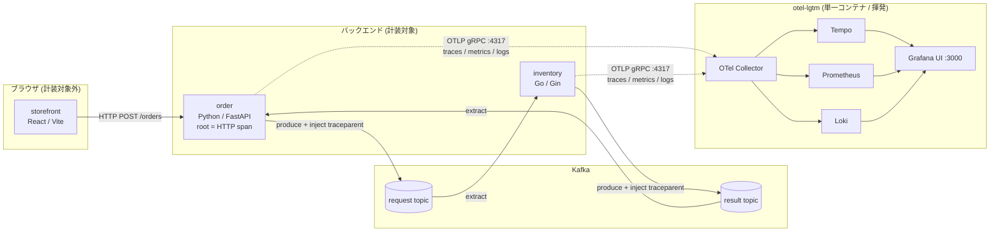
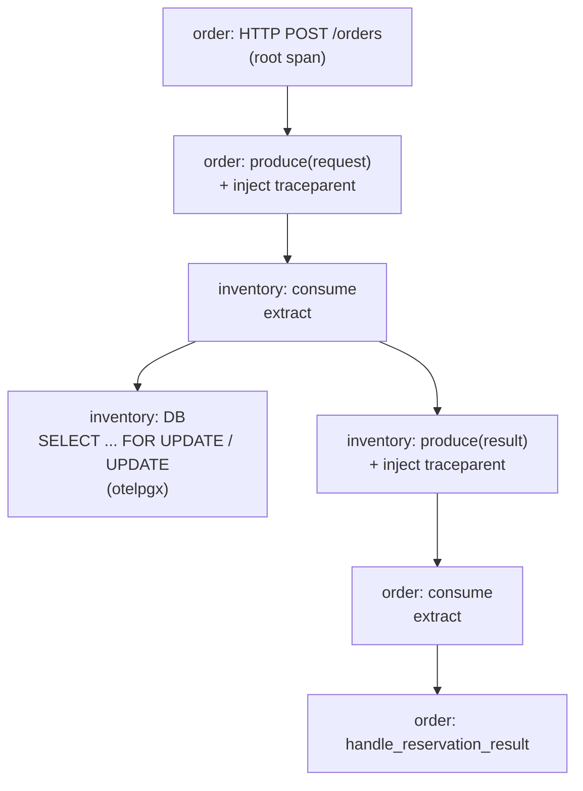

# オブザーバビリティ仕様書 (OpenTelemetry 組み込み)

本書は `sample-ec-service` への OpenTelemetry (以下 OTel) 組み込みの設計仕様を定める。
実装は本書に基づき完了済み (order / inventory 両サービス + compose)。

## 1. 目的と背景

現状、本サービス群にはオブザーバビリティ機構が一切ない (stdlib ログのみ)。
このラボで**分散トレーシング・メトリクス・ログの3シグナル**を体験できるようにするため OTel を組み込む。

最大の狙いは **saga をまたぐ1本の連続トレース** である。
注文処理は以下の choreography saga であり、`correlation_id` で相関している:

```
order → Kafka(request) → inventory → Kafka(result) → order
```

これを OTel の trace context 伝播により **単一 trace_id で連結**し、
`POST /orders` から在庫 DB 更新・結果処理までを Grafana Tempo 上で1本の trace ツリーとして可視化する。

## 2. 対象コンポーネント

| コンポーネント | 言語 / スタック | 計装 |
|----------------|-----------------|------|
| inventory | Go / Gin・pgx v5・confluent-kafka-go | 対象 |
| order | Python / FastAPI・asyncpg・confluent-kafka | 対象 |
| storefront | React / Vite | **対象外** |

storefront (ブラウザ) は計装しない。したがって order の HTTP サーバ span が trace の root になる。
CORS 設定も変更しない。

## 3. 全体アーキテクチャ



- 収集基盤は `grafana/otel-lgtm` 単一コンテナ (OTel Collector + Tempo + Loki + Prometheus + Grafana)。
- 全サービスは **OTLP gRPC (`:4317`)** で `otel-lgtm` にエクスポートする。
- Grafana を host `:3000` に公開して閲覧する。

## 4. 設計方針 (確定事項)

| # | 項目 | 決定 |
|---|------|------|
| 1 | シグナル | トレース + メトリクス + ログ (ログは trace_id 相関) |
| 2 | 収集/可視化基盤 | `grafana/otel-lgtm` 単一コンテナ、**データは揮発** (ボリューム無し) |
| 3 | 計装範囲 | バックエンドのみ (storefront・CORS は不変) |
| 4 | order の計装スタイル | プログラマティック SDK 初期化 (ゼロコードエージェントは使わない) |
| 5 | Kafka 伝播 | **両サービスとも完全手動で対称** (`extract → span → inject`)。自動 Instrumentor は使わない |
| 6 | 非同期 saga のモデル | **親子 (parent-child) 伝播** (Tempo 上で1本のツリー) |
| 7 | Go のログ | slog へ**全面移行**、ホットパスは `...Context(ctx,...)` |
| 8 | メトリクス | 自動 + **カスタム2種** (予約成功/失敗・注文ステータス遷移) |
| 9 | OTLP プロトコル | **gRPC (:4317)** |
| 10 | バージョン固定 | 既存慣習に合わせる (Python は `>=`、LGTM はタグ固定、Go は go.sum) |
| 11 | サンプリング | always-on (100%) |

### 4.1 主要な設計判断の根拠

- **Kafka を完全手動にした理由**: order の consumer は
  `await loop.run_in_executor(None, self._consumer.poll, 0.1)` で **poll を別スレッドで回し、
  `_process` はイベントループ側スレッドで実行**する。confluent-kafka の自動 consumer 計装は
  「poll が返した span を current context に載せ次の poll まで保持」する方式のため、
  span が executor スレッド側に載り、ループ側の `_process` が consume span の下にネストしない。
  この構造的ミスマッチを避けるため両サービスとも手動伝播に統一する
  (Go と同じ `extract → span → inject` のメンタルモデルに揃い、教材価値も高い)。
- **親子伝播にした理由**: saga は 1 request → 1 result の 1:1 であり fan-in が無い。
  親 span (HTTP/producer) が先に終了しても Tempo は同一 trace_id を1本に束ねるため、
  ツリー状に一望できデモとして分かりやすい (span links の厳密性は過剰)。

## 5. 共通の環境変数規約

`compose.yaml` で両サービスに付与する (標準 `OTEL_*`):

| 変数 | 値 |
|------|-----|
| `OTEL_EXPORTER_OTLP_ENDPOINT` | `http://otel-lgtm:4317` |
| `OTEL_EXPORTER_OTLP_PROTOCOL` | `grpc` |
| `OTEL_SERVICE_NAME` | `inventory` / `order` |
| `OTEL_RESOURCE_ATTRIBUTES` | `service.namespace=sample-ec,deployment.environment=local` |

SDK は endpoint スキーム `http://` を insecure として解釈するため TLS 設定は不要。
export のバッチ/間隔/タイムアウトは SDK 既定を用いる。

## 6. インフラ変更 (`compose.yaml`)

- サービス `otel-lgtm` を追加:
  - image: `grafana/otel-lgtm:0.30.0`
  - ports: `["3000:3000"]` (Grafana UI)
  - **ボリュームは付けない (揮発)**
  - healthcheck: `curl -sf localhost:3000/api/health` (イメージには curl のみ同梱)
  - `observability/grafana/` の provisioning YAML と dashboards ディレクトリを読み取り専用でマウント (→ §12)
- `inventory` / `order-service` に §5 の `OTEL_*` env を追加。
- 両サービスに `depends_on: otel-lgtm` (condition 不要 — exporter はリトライする)。

## 7. order サービス (Python) の計装仕様

### 7.1 依存追加

`services/order/pyproject.toml` の `dependencies` に (既存に合わせ `>=` 下限指定):

```
opentelemetry-sdk
opentelemetry-exporter-otlp-proto-grpc
opentelemetry-instrumentation-fastapi
opentelemetry-instrumentation-asyncpg
opentelemetry-instrumentation-logging
```

confluent-kafka の Instrumentor は**追加しない** (Kafka は手動伝播)。
Dockerfile は `pip install .` のため変更不要。

### 7.2 SDK 初期化 (新規 `internal/telemetry/otel.py`)

- `Resource` (`OTEL_*` env から自動取得) で `TracerProvider` / `MeterProvider` / `LoggerProvider` を構築。
- OTLP gRPC exporter を接続: `BatchSpanProcessor` / `PeriodicExportingMetricReader` / `BatchLogRecordProcessor`。
- グローバル propagator を W3C TraceContext に明示設定。
- `setup_telemetry()` を公開し shutdown フックを返す。

### 7.3 `main.py` の変更

- `run()` 冒頭 (`Settings()` 直後、DB/Kafka 生成前) で `setup_telemetry()` を呼ぶ。
- `FastAPIInstrumentor.instrument_app(app)`、`AsyncPGInstrumentor().instrument()`。
- ログ: `LoggingInstrumentor().instrument(set_logging_format=True)` で trace_id/span_id を注入し、
  ルートロガーに OTel `LoggingHandler` を追加して Loki へエクスポート。

### 7.4 Kafka 手動伝播

- **producer.py**: publish 時に producer span を開始し、
  `opentelemetry.propagate.inject` で得た dict を confluent_kafka の
  `headers=[(k, v.encode()), ...]` として送信。
  messaging semconv 属性 (`messaging.system=kafka`, `messaging.destination.name`,
  `messaging.operation=publish`) を付与。
- **consumer.py**: `_process` 内で `msg.headers()` を dict 化 → `propagate.extract` →
  抽出 context を親に consumer span を開始し、その中で `handle_reservation_result` を実行する。
  span を張るのは executor ではなく**ループ側スレッドの `_process`** とし、親子ネストを確実にする。

### 7.5 カスタムメトリクス

- 注文ステータス遷移カウンタ
  `order.status.transitions{status=PENDING|CONFIRMED|FAILED|CANCELLED}` を usecase に追加。

## 8. inventory サービス (Go) の計装仕様

### 8.1 依存追加 (`go get` で go.mod / go.sum 更新)

```
go.opentelemetry.io/otel
go.opentelemetry.io/otel/sdk
go.opentelemetry.io/otel/exporters/otlp/otlptrace/otlptracegrpc
go.opentelemetry.io/otel/exporters/otlp/otlpmetric/otlpmetricgrpc
go.opentelemetry.io/otel/exporters/otlp/otlplog/otlploggrpc
go.opentelemetry.io/otel/sdk/log
go.opentelemetry.io/contrib/instrumentation/github.com/gin-gonic/gin/otelgin
go.opentelemetry.io/contrib/instrumentation/runtime
go.opentelemetry.io/contrib/bridges/otelslog
github.com/exaring/otelpgx
```

Dockerfile は `go mod download` + build のため構成変更は不要。

### 8.2 SDK 初期化 (新規 `internal/telemetry/telemetry.go`)

- `Setup(ctx) (shutdown func(context.Context) error, error)` を公開。
- `resource` (env 検出) で `TracerProvider` / `MeterProvider` (otlpmetricgrpc + periodic reader) /
  `LoggerProvider` (otlploggrpc) を構築し `otel.SetTracerProvider` 等でグローバル登録。
- `otel.SetTextMapPropagator(propagation.TraceContext{})`。

### 8.3 `main.go` の変更

- `config.Load()` 直後に `telemetry.Setup(ctx)`、`defer shutdown(...)`。
- pgxpool: `pgxpool.ParseConfig` → `cfg.ConnConfig.Tracer = otelpgx.NewTracer()` →
  `pgxpool.NewWithConfig` (現状の `pgxpool.New` から変更)。
- Gin: `r.Use(otelgin.Middleware("inventory"))` を CORS の前に追加。
- ランタイムメトリクス: `runtime.Start(...)`。
- ログ**全面移行**: `otelslog` で `*slog.Logger` を生成し、
  `main.go` / `consumer.go` / `producer.go` の全 `log.Printf`/`Fatalf`/`Println` を slog へ置換。
  span 内は `slog.InfoContext(ctx, ...)` で trace 相関、起動時は `context.Background()`。

### 8.4 Kafka 手動伝播

- 新規 `KafkaHeaderCarrier` (`[]kafka.Header` を `propagation.TextMapCarrier` として Get/Set/Keys 実装)。
- **producer.Publish(ctx, ...)**: producer span を開始し `otel.GetTextMapPropagator().Inject(ctx, carrier)` で
  `kafka.Message.Headers` に traceparent を注入。messaging semconv 属性を付与。
- **consumer.Run / process**: `msg.Headers` から `Extract` → 親 context で consumer span を開始 →
  その ctx を `usecase.Reserve` と後続の `producer.Publish` に伝播する。

### 8.5 カスタムメトリクス

- 予約成功/失敗カウンタ `inventory.reservations{result=success|failure}` を usecase に追加。

## 9. トレース連結 (受入基準)

`POST /orders` の HTTP span を root として、以下が**同一 trace_id** で
Tempo 上に1本の trace ツリーとして表示されること:



header key は両側とも W3C `traceparent` で互換。

## 10. 検証 (end-to-end)

1. `docker compose up --build -d` で全サービス + `otel-lgtm` を起動。`docker compose ps` で healthy 確認。
2. トラフィック生成:
   ```bash
   curl -s -X POST http://localhost:8081/orders \
     -H "Content-Type: application/json" \
     -d '{"customer_id": "user-123", "items": [{"inventory_id": 1, "quantity": 2}]}'
   ```
   または storefront から注文。
3. Grafana (`http://localhost:3000`):
   - **Tempo**: 直近トレースを検索し、order の POST /orders から inventory の DB/Kafka span まで
     **1本の trace に連結**されていること (service graph も確認)。
   - **Prometheus**: order の HTTP メトリクス、inventory の Go runtime メトリクス、
     カスタムの予約/注文ステータスカウンタが存在すること。
   - **Loki**: 両サービスのログに `trace_id` が付与され、trace ⇄ logs をジャンプできること。
4. `go test ./...` (inventory)、`pytest` (order) が引き続きパスし、計装コードのビルドが通ること。
5. トレースが連結しない場合は、Kafka ヘッダの inject/extract を最小再現で確認して修正する。

## 11. スコープ外

- storefront (ブラウザ) 計装 / CORS 変更
- 本番向けの認証・サンプリング戦略・永続ストレージ・アラート/ダッシュボード定義
  (ラボ用途のため既定のまま)
- CI ワークフローの変更 (go.sum / pyproject の変更は既存ワークフローが自動で拾う)
- health / readiness エンドポイント

## 12. Grafana ダッシュボード (provisioning)

起動時に Grafana へ自動投入する **EC Overview** ダッシュボードを同梱する。

- 配置:
  - `observability/grafana/dashboards/ec-overview.json` — ダッシュボード本体 (uid `ec-overview`)
  - `observability/grafana/provisioning/dashboards/custom.yaml` — file プロバイダ定義
- compose の `otel-lgtm` に read-only でマウント:
  - `custom.yaml` → `/otel-lgtm/grafana/conf/provisioning/dashboards/custom.yaml`
  - `dashboards/` → `/otel-lgtm/grafana/conf/provisioning/dashboards/custom`
- datasource UID は otel-lgtm 固定値 (`prometheus` / `loki` / `tempo`) を参照。

### パネル構成 (実際の指標名で検証済み)

| 区分 | パネル | 主なクエリ (指標) |
|------|--------|-------------------|
| **SLI/SLO** | 閲覧 可用性 (inventory 非5xx率) | `http_server_request_duration_seconds_count{service_name="inventory"}` の非5xx率。SLO ≥99.9% |
| **SLI/SLO** | 閲覧 p95 レイテンシ (inventory) | `histogram_quantile(0.95, …http_server_request_duration_seconds_bucket{service_name="inventory"}…)` (秒)。SLO <0.5s |
| **SLI/SLO** | 注文作成 可用性 (order POST /orders) | `http_server_duration_milliseconds_count{service_name="order",http_target="/orders",http_method="POST"}` の非5xx率。SLO ≥99.5% |
| **SLI/SLO** | 注文確定 ビジネス成功率 | `confirmed/(confirmed+failed)` = `order_status_transitions_total`。**在庫切れ (FAILED) を含むビジネス指標**。SLO ≥99% (黄 ≥95%) |
| **SLI/SLO** | 閲覧 / 注文作成 レイテンシ p95・p99 + SLO しきい線 | 上記 bucket の分位点 (inventory=秒 0.5s 線 / order=ms 500ms 線) |
| サマリ | 注文作成数 / 予約成功率 / 確定 / 失敗 | `order_status_transitions_total`, `inventory_reservations_total` |
| saga | 注文ステータス遷移レート | `sum by (status)(rate(order_status_transitions_total[…]))` |
| saga | 在庫予約 成功/失敗レート | `sum by (result)(rate(inventory_reservations_total[…]))` |
| HTTP | リクエストレート / レイテンシ p50・p95・p99 | `http_server_duration_milliseconds_{count,bucket}{service_name="order"}` |
| inventory | goroutine 数 / 使用メモリ / DB p95 | `go_goroutine_count`, `go_memory_used_bytes`, `db_client_operation_duration_seconds_bucket` |
| ログ | order / inventory ログ | Loki `{service_name=~"order|inventory"}` |

> **指標名の注意**: OTel → Prometheus 変換でドットは `_`、カウンタには `_total`、単位が名前に付く
> (例: `http.server.duration` ms → `http_server_duration_milliseconds_*`)。
>
> **HTTP メトリクスは2サービスで semconv が異なる**:
> - **order (FastAPI 計装)**: 旧 semconv の**ミリ秒**ヒストグラム
>   `http_server_duration_milliseconds_*`。ラベルは `http_status_code` / `http_method` /
>   `http_target` (実パス。`/orders/{id}` は具体 ID が入り、OPTIONS では欠落)。
> - **inventory (otelgin 計装)**: 新 semconv の**秒**ヒストグラム
>   `http_server_request_duration_seconds_*`。ラベルは `http_response_status_code` /
>   `http_request_method` / `http_route` (テンプレート化済み: `/inventories`, `/inventories/:id`)。
>
> したがって HTTP 系の横断クエリは**メトリクス名・単位・ラベル名を両サービスで書き分ける**必要がある。

> **SLI の解釈上の注意**: 「注文確定 ビジネス成功率」と「在庫予約 成功率」は、在庫不足
> (ビジネス起因の拒否) を失敗として数える。純粋な**信頼性 SLI ではなくビジネス指標**であり、
> システム信頼性は HTTP 非5xx 可用性で判断する。在庫切れとシステムエラーを分離するには
> カウンタのラベル分割 (計装変更) が必要で、本ダッシュボードのスコープ外。
```
